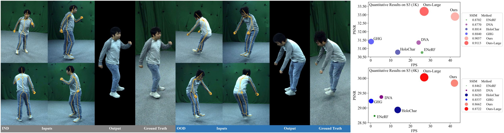

# DUT

<div align="center">

# Real-time Free-view Human Rendering from Sparse-view RGB Videos using Double Unprojected Textures

### [Guoxing Sun](https://people.mpi-inf.mpg.de/~gsun/)<sup>1</sup>, [Rishabh Dabral](https://rishabhdabral.github.io/)<sup>1,2</sup>, [Heming Zhu](https://people.mpi-inf.mpg.de/~hezhu/)<sup>1</sup>, [Pascal Fua](https://people.epfl.ch/pascal.fua)<sup>3</sup>, [Christian Theobalt](https://people.mpi-inf.mpg.de/~theobalt/)<sup>1,2</sup>, [Marc Habermann](https://people.mpi-inf.mpg.de/~mhaberma/)<sup>1,2</sup>

#### <p><sup>1</sup>Max Planck Institute for Informatics, Saarland Informatics Campus &nbsp;&nbsp;<sup>2</sup>VIA Research Center &nbsp;&nbsp;<sup>3</sup>EPFL

### [Project Page](https://vcai.mpi-inf.mpg.de/projects/DUT/) | [Paper](https://arxiv.org/abs/2412.13183) | [Dataset](https://gvv-assets.mpi-inf.mpg.de/DUT) 

</div>


## :hammer_and_wrench: Requirements
- Create conda environment `conda create --name dut python=3.9`
- Install cuda11.8: `conda install cudatoolkit=11.8 cudnn -c conda-forge`
- Install PyTorch==2.0.0+cu118: `pip install torch==2.0.0 torchvision==0.15.1 torchaudio==2.0.1 --index-url https://download.pytorch.org/whl/cu118 --no-cache-dir`
- Install pytorch3d: `pip install --no-cache-dir pytorch3d==0.7.3 -f https://dl.fbaipublicfiles.com/pytorch3d/packaging/wheels/py39_cu118_pyt200/download.html`
- Install kaolin: `pip install kaolin==0.15.0 -f https://nvidia-kaolin.s3.us-east-2.amazonaws.com/torch-2.0.0_cu118.html`
- `pip install -r requirements.txt`
- Install modules through following commond:
    ```
    cd ./tools/extensions/cuda_projection
    python setup.py install
    cd ../../..
  
    cd ./tools/extensions/cuda_skeleton
    python setup.py install
    cd ../../..
  
    cd ./tools/extensions/simple-knn
    python setup.py install
    cd ../../..
  
    cd ./tools/extensions/diff-gaussian-rasterization-mip
    python setup.py install
    cd ../../..
  
    cd ./tools/extensions/nvdiffrast
    pip install .
    cd ../../..
    ```

## :movie_camera: Data
```
  # Step 1: Download demo data from https://gvv-assets.mpi-inf.mpg.de/DUT and place them in ./datas
  # datas
  #   ├── shaders (exists there)
  #   ├── vis (exists there)
  #   ├── preprocess_data.py (exists there)
  #   ├── preprocess_data_s2618.py (exists there)
  #   ├── select_self_intersection.mlx (exists there)
  #   └── demo
  
  # Step 2: Download DUT dataset from: https://gvv-assets.mpi-inf.mpg.de/DUT to /XX/XX/DUT_official(where to save dataset)
  #         Edit the script "./data/process_data.py", base_dir = /XX/XX/DUT_official
  #         Run the following scripts to generate training datas and testing datas:
  cd ./datas
  python ./preprocess_data.py -subi 724 -ct tight -st training
  python ./preprocess_data.py -subi 724 -ct tight -st training -cs
  python ./preprocess_data.py -subi 724 -ct tight -st testing
  python ./preprocess_data.py -subi 724 -ct tight -st testing -cs
  # Option, geting sparse images for inference, which is more efficient,
  # when evaluation is not necessary.
  # Note, edit indices under isSparse before use it.
  # python ./preprocess_data.py -subi 724 -ct tight -st testing --sparse
  # python ./preprocess_data.py -subi 724 -ct tight -st testing --sparse -cs
  # change the subi (subject index) and ct (cloth type) to process other subjects
  cd ..
```

## :leopard: Fast Demo
```
# Fast demo with provided demo data and checkpoints.
python ./infer_full_normal_xyz.py  --split testing --config ./configs/s724.yaml --deltaType xyz \
 --ckpt1 ./datas/demo/ckpt/s724_geometry_256/s724_150000.pth  --ckpt2 ./datas/demo/ckpt/s724_gaussian_512/s724_1970000.pth \
 --texResGeo 256 --texResGau 512 --demo --saveDebug
```

## :runner: Run
```
#Step I: Prepare First Texture Cache
python ./infer_full_normal_xyz.py  --split testing --config ./configs/s724.yaml --saveTexFirst --deltaType xyz

#Step II: Train GeoNet
bash ./scripts/s724/submit_1gpu_3hour_s724_geometry_texResGeo256_xyz_iso0.5.sh

#Step III: Prepare Second Texture Cache
python ./infer_full_normal_xyz.py  --split testing --config ./configs/s724.yaml --saveTexSecond --deltaType xyz --ckpt1 /CkptPathOfGeometry/s724_150000.pth

#Step IV: Train GeoNet
bash ./scripts/s724/submit_1gpu_24hour_s724_gaussian_texResGeo256_xyz_1k.sh

#Step V: Infer
python ./infer_full_normal_xyz.py  --split testing --config ./configs/s724.yaml --saveDebug --deltaType xyz --ckpt1 /CkptPathOfGeometry/s724_150000.pth --ckpt2 /CkptPathOfGaussian/s724_1970000.pth --texResGeo 256 --texResGau 512 --vis
```


## :straight_ruler: Evaluate
```
# evaluate geometry results
python ./train_geometry.py --split test --config ./configs/s724.yaml --ckpt /CkptPathOfGeometry/s724_150000.pth

# evaluate rendering results
cd ./evaluations
python ./00_eval_dut.py # edit subjectType, scale, tagName
```

## :clock10: Inference Time
When cleaning code, we found a hyper-parameter typing error regrading inference time evaluation of **Ours-large**, namely we used 
"--texResGeo 512 --texResGau 256" instead of "--texResGeo 256 --texResGau 512". We fix such bug and update the teaser figure and inference time
evaluation table in the latest arxiv.
```
# evaluate time
python ./infer_full_normal_xyz_time.py --split testing --config ./configs/s3.yaml --deltaType xyz \
  --ckpt1 /CkptPathOfGeometry/s3_150000.pth \
  --ckpt2 /CkptPathOfGaussian/s3_1970000.pth \
   --texResGeo 256 --texResGau [256 or 512] --imgScale [0.25 or 1.0]
```

## :wrench: Potential bug fixing
In the original implementation of GauNet (./models/unet.py UNet), we followed ASH and used batch norm by default, which performs not well with batch size of 1.
Thus, we recommend to use group norm, you may edit the code where I commented out in (DoubleConv). For reusage of our provided checkpoint, we keep the bug and use batch norm in the current version.

## :rose: Acknowledgements
Some great prior works and codes we benefit from: [3DGStreamViewer](https://github.com/SJoJoK/3DGStreamViewer), [Nvdiffrast ](https://github.com/NVlabs/nvdiffrast),
[EasyMocap](https://github.com/zju3dv/EasyMocap), [metacap](https://github.com/sunshinnnn/metacap), [GPS-Gaussian](https://github.com/aipixel/GPS-Gaussian)

## :book:  License
Both the source code and our data are under the terms of the [Attribution-NonCommercial 4.0 International (CC BY-NC 4.0) license](https://creativecommons.org/licenses/by-nc/4.0/legalcode). 
This project is only for research or education purposes, and not freely available for commercial use or redistribution. You may drop email to authors to inquire details or authorizations.

## :beer: Citation
If you find the codes or datasets from this repository helpful in your projects, welcome to cite our paper and give a star.
```
@InProceedings{sun2025real,
title = {Real-time Free-view Human Rendering from Sparse-view RGB Videos using Double Unprojected Textures},
author = {Sun, Guoxing and Dabral, Rishabh and Zhu, Heming and Fua, Pascal and Theobalt, Christian and Habermann, Marc},
year = {2025},
month = {June},
booktitle = {Proceedings of the IEEE/CVF Conference on Computer Vision and Pattern Recognition (CVPR)},
}
```